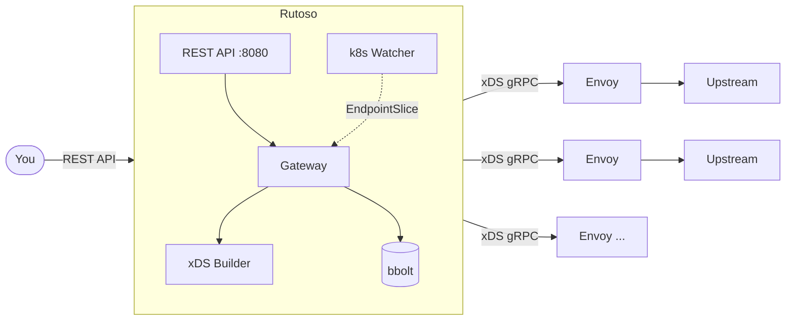

# Rutoso

REST API control plane for Envoy proxies. You define routes, groups, destinations, listeners, and middlewares through a REST API — Rutoso pushes the configuration to all connected Envoy instances via xDS in real time. No restarts, no static files.

## How it works

Rutoso sits between you and your Envoy fleet:

```
You → REST API (Rutoso) → xDS gRPC → Envoy proxies
```

Every change you make through the API is immediately translated into an Envoy xDS snapshot and pushed to all connected proxies. The data lives in a single bbolt file — no external database needed.

## Concepts

**Destination** — an upstream target (host + port). Maps to an Envoy cluster. Supports health checks, circuit breakers, load balancing algorithms, and Kubernetes service discovery (EDS via EndpointSlice watcher).

**Route** — defines what traffic looks like (path, headers, methods, query params) and what to do with it (forward to destinations, redirect, or return a fixed response). Forwarding supports weighted backends, retries, timeouts, URL rewriting, WebSocket upgrade, and request mirroring.

**Group** — organizes routes under a shared path prefix or regex, shared hostnames, and shared headers. Think of it as a virtual host scope. Groups can also set a default retry policy for all their routes.

**Listener** — an address:port where Envoy accepts connections. Supports HTTP/2, access logs, TLS (model ready, wiring in progress), and TCP-level filters like tls_inspector and proxy_protocol.

**Middleware** — a reusable behaviour you attach to routes or groups. CORS, JWT authentication, external authorization (ext_authz), external processing (ext_proc), rate limiting, and header manipulation. Create the middleware once, reference it by ID wherever you need it. Rutoso handles registering it in Envoy's filter pipeline and enabling/disabling it per route automatically.

## Architecture



Swagger UI with the full API spec is at `/api/v1/docs/` once Rutoso is running.

## Dev environment

Requirements: Go 1.24+, Kind, kubectl, Docker.

```bash
# Spin up a Kind cluster with Envoy, then start Rutoso locally:
make dev-up

# Rutoso REST API:  http://localhost:8080/api/v1/
# Swagger UI:       http://localhost:8080/api/v1/docs/
# Envoy proxy:      http://localhost:30000
# Envoy admin:      http://localhost:30901
```

Rutoso runs in the foreground. Ctrl+C stops it. The cluster keeps running — `make dev-down` destroys it.

```bash
# Tail Envoy logs (see xDS events):
make dev-envoy-logs

# Inspect what Envoy has loaded:
make dev-envoy-admin
# Then open http://localhost:9901/config_dump
```

## Build

```bash
# Binary:
make build
# Output: ./bin/rutoso

# Docker image:
make docker-build
```

## Run

```bash
# With defaults (API on :8080, xDS on :18000, store in /tmp/rutoso.db):
./bin/rutoso --config config.yaml

# Override via env vars:
SERVER_ADDRESS=:9090 XDS_ADDRESS=:19000 ./bin/rutoso --config config.yaml --store-path /data/rutoso.db
```

## Configuration

`config.yaml` — all values support `${ENV_VAR:-default}` syntax:

```yaml
server:
  address: "${SERVER_ADDRESS:-:8080}"
xds:
  address: "${XDS_ADDRESS:-:18000}"
log:
  format: "${LOG_FORMAT:-console}"   # console or json
  level: "${LOG_LEVEL:-info}"        # debug, info, warn, error
```

## Deploy

The Docker image is distroless and runs as nonroot. The binary needs:
- A config file (mount or bake in)
- A writable path for the bbolt database
- Network access to Envoy proxies on the xDS port

```bash
docker run -d \
  -v ./config.yaml:/config.yaml \
  -v rutoso-data:/data \
  -p 8080:8080 -p 18000:18000 \
  achetronic/rutoso:latest \
  --config /config.yaml --store-path /data/rutoso.db
```

Envoy proxies connect to Rutoso's xDS address (`18000` by default) using ADS over gRPC. Point Envoy's bootstrap `config_source` at Rutoso and it will receive configuration automatically.

## Kubernetes discovery

If Rutoso runs inside a Kubernetes cluster (or has a valid kubeconfig), it watches EndpointSlice resources for destinations with `discovery.type: "kubernetes"`. Pod IPs are pushed to Envoy via EDS — no DNS involved, real pod-level load balancing.

If no kubeconfig is available, the watcher is silently disabled and Rutoso works fine without it.

## License

Apache 2.0
