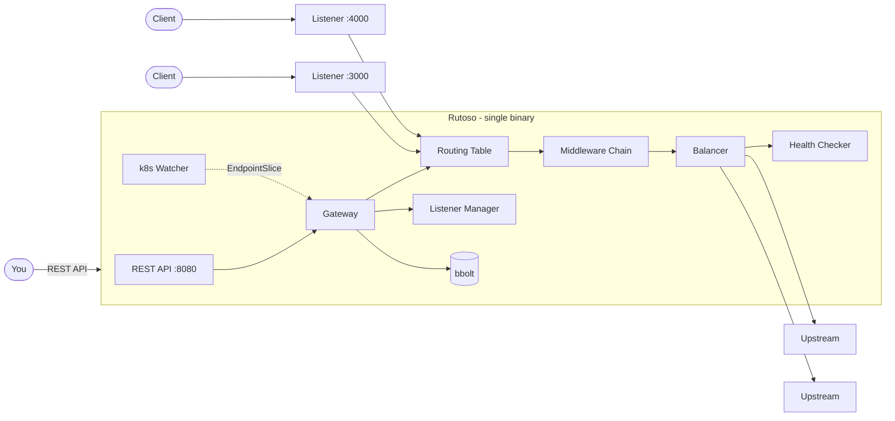

# Rutoso

Programmable HTTP reverse proxy with a REST API. You define routes, destinations, listeners, and middlewares through the API — Rutoso applies the configuration instantly without restarts. No Envoy, no NGINX, no external proxy. One binary.

## How it works

```
You → REST API (:8080) → Rutoso reconfigures itself
Clients → Proxy listeners (:N) → Upstream destinations
```

Every change you make through the API is applied atomically. Active connections are not dropped. The data lives in a single bbolt file — no external database.

## Architecture



Swagger UI at `/api/v1/docs/` once running.

## Concepts

**Destination** — an upstream target (host + port). Supports TLS, health checks, circuit breakers, load balancing (round robin, ring hash, maglev, least request, random), outlier detection, and Kubernetes service discovery.

**Route** — defines what traffic looks like (path, headers, methods, query params) and what to do with it (forward, redirect, or direct response). Forwarding supports weighted backends, retries, timeouts, URL rewriting, request mirroring, and sticky sessions via hash policy.

**Group** — organizes routes under a shared path prefix or regex, shared hostnames, and shared headers. Sets default retry policy for all routes. Optional — routes work standalone.

**Listener** — an address:port where Rutoso accepts traffic. Supports TLS, access logs, server name, and request header size limits.

**Middleware** — a reusable behaviour you attach to routes or groups: CORS, external authorization, header manipulation, rate limiting, JWT validation. Create once, reference by ID wherever needed.

## Quick start

```bash
make run
```

Then in another terminal:

```bash
# Create a listener on port 3000
curl -X POST localhost:8080/api/v1/listeners \
  -H 'Content-Type: application/json' \
  -d '{"name":"main","port":3000}'

# Create a destination
DEST=$(curl -s -X POST localhost:8080/api/v1/destinations \
  -H 'Content-Type: application/json' \
  -d '{"name":"httpbin","host":"httpbin.org","port":80}' | jq -r .id)

# Create a route
curl -X POST localhost:8080/api/v1/routes \
  -H 'Content-Type: application/json' \
  -d '{"name":"test","match":{"pathPrefix":"/"},"forward":{"backends":[{"destinationId":"'$DEST'","weight":100}]}}'

# Test it
curl localhost:3000/get
```

## Build

```bash
make build          # Binary: ./bin/rutoso
make docker-build   # Docker image
make test           # Run tests
```

## Run

```bash
./bin/rutoso --config config.yaml --store-path /data/rutoso.db
```

## Configuration

`config.yaml` — all values support `${ENV_VAR:-default}`:

```yaml
server:
  address: "${SERVER_ADDRESS:-:8080}"
log:
  format: "${LOG_FORMAT:-console}"
  level: "${LOG_LEVEL:-info}"
```

## Deploy

```bash
docker run -d \
  -v ./config.yaml:/config.yaml \
  -v rutoso-data:/data \
  -p 8080:8080 \
  achetronic/rutoso:latest \
  --config /config.yaml --store-path /data/rutoso.db
```

Proxy listeners are created dynamically via the API. Expose whatever ports you need.

## Kubernetes discovery

If Rutoso has a valid kubeconfig (in-cluster or ~/.kube/config), it watches EndpointSlice resources for destinations with `discovery.type: "kubernetes"`. Pod IPs are resolved directly — real pod-level load balancing without DNS.

If no kubeconfig is available, the watcher is silently disabled.

## License

Apache 2.0
