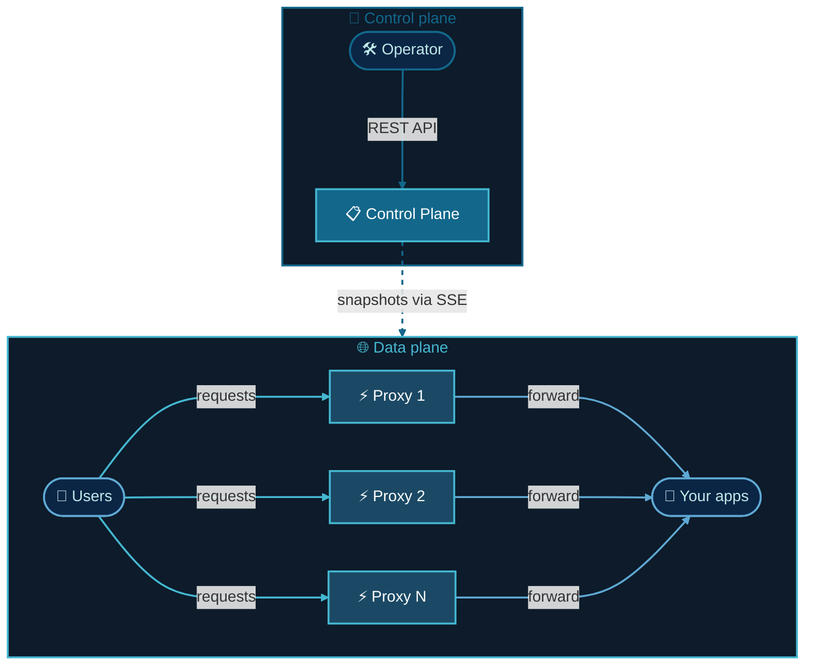

<p align="center">
  
</p>

<p align="center">
  A programmable HTTP reverse proxy. One binary, zero dependencies.<br/>
  Configure everything through a REST API. Changes apply instantly.
</p>

---

## What is Vrata?

Vrata is a reverse proxy you configure through an API instead of files. You create listeners, destinations, routes, and middlewares — Vrata applies them on the fly without restarts.

## What can you do with it? <sub>highlights — [full reference →](docs/features.md)</sub>

<details>
<summary>🔹 Smart routing with CEL expressions</summary>

<br/>

Match on anything: path, headers, methods, query params, hostnames, gRPC — or write [CEL expressions](https://github.com/google/cel-go) for logic that static matchers can't express. Group routes under shared namespaces with inherited matchers. Every regex is compiled once at build time — zero per-request cost.

```
request.path.startsWith("/api") && "admin" in request.headers["x-role"] && request.method != "DELETE"
```

| Path (prefix, exact, regex) | Headers (exact, regex) | Methods | Query params | Hostnames | gRPC | CEL |
|:--:|:--:|:--:|:--:|:--:|:--:|:--:|
| ✓ | ✓ | ✓ | ✓ | ✓ | ✓ | ✓ |

</details>

<details>
<summary>🔹 Canary deploys, traffic splits, and sticky sessions</summary>

<br/>

Two independent balancing levels — the first picks which service, the second picks which pod:

| | Destination (which service?) | Endpoint (which pod?) |
|---|---|---|
| **Simple** | Weighted random | Round robin, random |
| **Sticky** | Consistent hash (cookie) | Ring hash, maglev (header/cookie/IP) |
| **Zero-disruption** | Redis-backed sticky | Redis-backed sticky |
| **Smart** | — | Least request (power of two choices) |

Change weights at runtime. Existing sessions survive weight changes. New clients follow the new distribution. No restarts, no dropped connections.

</details>

<details>
<summary>🔹 Request and response interception</summary>

<br/>

Mutate, inspect, or reject any request or response in flight — without touching your application:

- **External processor** — your gRPC or HTTP service receives each request/response phase (headers, body) and can mutate headers, replace bodies, or reject. Supports buffered, partial-buffered, and streamed body modes. Observe-only mode with async worker pool for logging/auditing.
- **External authorization** — delegate auth decisions to an external service (HTTP or gRPC). Forward headers, body, and control exactly what flows back on allow/deny.
- **Header manipulation** — add, remove, or replace request/response headers. Value interpolation with `${request.host}`, `${request.header.X-Custom}`, etc.

</details>

<details>
<summary>🔹 Security and access control</summary>

<br/>

- **JWT validation** — RSA (RS256/384/512), ECDSA (P-256/384/521), Ed25519. Remote JWKS with auto-refresh or inline keys. Issuer, audience, expiration checks. CEL-based claim assertions (`claims.org == "acme" && claims.role != "guest"`). Claim-to-header injection for upstream enrichment.
- **Rate limiting** — token bucket per client IP with configurable burst. Trusted proxy support for `X-Forwarded-For`.
- **CORS** — origin matching (exact, regex, wildcard `*`), preflight 204, credentials, max-age.
- **CEL conditions on any middleware** — `skipWhen` / `onlyWhen` expressions control exactly when a middleware runs, without duplicating routes.

</details>

<details>
<summary>🔹 Resilience — retries, circuit breakers, fallback routes</summary>

<br/>

When backends fail, Vrata doesn't just return a 502:

- **Retries** — exponential backoff, per-attempt timeout, configurable conditions (server-error, gateway-error, connection-failure, retriable status codes)
- **Circuit breaker** — per-destination, opens after consecutive failures, half-open probe with atomic single-request admission
- **Health checks** — active HTTP probes with configurable thresholds and intervals per destination
- **Outlier detection** — ejects endpoints with consecutive 5xx without active probing
- **`onError` fallback routes** — when the upstream is unreachable, route to a fallback, return a custom response, or redirect:

```json
"onError": [
  {"on": ["connection_refused", "timeout"], "forward": {"destinations": [{"destinationId": "fallback"}]}},
  {"on": ["circuit_open"], "directResponse": {"status": 503, "body": "{\"retry_after\": 30}"}}
]
```

Fallback destinations receive `X-Vrata-Error-*` headers with the full error context (what failed, where, why).

</details>

<details>
<summary>🔹 Real-time config — snapshots, instant rollback, zero downtime</summary>

<br/>

Every change goes through the API. Nothing touches a config file. Nothing requires a restart.

1. **Edit** routes, destinations, middlewares, listeners via REST API
2. **Snapshot** the current config — an immutable, named point-in-time capture
3. **Activate** — atomically push to all connected proxies via SSE
4. **Rollback** — activate a previous snapshot. One call. Instant.

In-flight requests complete on the old config. New requests use the new config. Zero dropped connections.

</details>

<details>
<summary>🔹 Full observability — 22 Prometheus metrics across 5 dimensions</summary>

<br/>

Enable per-listener. Every dimension independently toggleable:

| Dimension | What you see | Default |
|-----------|-------------|---------|
| **Route** | Requests, latency histograms, request/response size, in-flight, retries, mirrors | on |
| **Destination** | Requests, upstream latency, in-flight, circuit breaker state | on |
| **Endpoint** | Per-pod requests, latency, health state, consecutive 5xx | **off** (opt-in) |
| **Middleware** | Processing duration, pass/reject counts per middleware | on |
| **Listener** | Total connections, active connections, TLS handshake errors | on |

Custom histogram buckets. Endpoint dimension off by default to control cardinality at scale.

</details>

<details>
<summary>🔹 Kubernetes native — auto-discovery, Helm, pod-level balancing</summary>

<br/>

- **EndpointSlice watching** — set `discovery.type: "kubernetes"` on a Destination, Vrata resolves pod IPs automatically and updates on every scale event
- **ExternalName Services** — resolves `spec.externalName` and tracks changes
- **Pod-level balancing** — combine k8s discovery with any endpoint balancing algorithm (ring hash for sticky, least request for even distribution)
- **Helm chart** — control plane as StatefulSet (with Raft), proxies as Deployment. Production-ready `values.yaml` included

</details>

<details>
<summary>🔹 HA control plane — Raft consensus, 3-5 nodes, automatic failover</summary>

<br/>

- **Embedded Raft** — 3-5 node control plane with hashicorp/raft. Every node has a full copy of the config.
- **Transparent writes** — any node accepts reads and writes. Followers forward writes to the leader. Clients don't need to know who leads.
- **DNS peer discovery** — point to a Kubernetes headless Service, nodes find each other automatically. Handles cold starts with retry.
- **Instant failover** — leader dies, Raft elects a new one. Proxies reconnect to any surviving node via the k8s Service. Zero manual intervention.

</details>

> [!IMPORTANT]
> Every field, every parameter, every option — with JSON examples:
> **→ [docs/features.md](docs/features.md)**

## Architecture

Vrata has two components:

- **Control plane** — exposes the REST API, stores configuration, and pushes it to proxies via SSE.
- **Proxy** — stateless, connects to the control plane, receives config, routes traffic. Run 1 or 100.



Traffic flows through the proxies. The control plane is off the data path — it only pushes configuration.

In development, one process runs both. In production, you split them.

## Configuration

Vrata reads a YAML config file via `--config`. Every string value supports `${ENV_VAR}` substitution.

The repo includes [`config.yaml`](config.yaml) with all options commented. The two essential configs:

**Control plane** (or single-process dev):

```yaml
mode: "controlplane"
controlPlane:
  address: ":8080"
  storePath: "vrata.db"
```

**Proxy** (production fleet):

```yaml
mode: "proxy"
proxy:
  controlPlaneUrl: "http://control-plane:8080"
  reconnectInterval: "5s"
```

Optional sections: `cluster` (Raft HA), `sessionStore` (Redis for sticky sessions), `log`. See [`config.yaml`](config.yaml) for the full reference.

## Quick start

### 1. Build and start

```bash
make build
vrata --config config.yaml
```

API on `:8080`. Swagger UI at [localhost:8080/api/v1/docs/](http://localhost:8080/api/v1/docs/).

### 2. Open a port

```bash
curl -X POST localhost:8080/api/v1/listeners \
  -H 'Content-Type: application/json' \
  -d '{"name": "main", "port": 3000}'
```

### 3. Create a destination

```bash
curl -X POST localhost:8080/api/v1/destinations \
  -H 'Content-Type: application/json' \
  -d '{"name": "httpbin", "host": "httpbin.org", "port": 80}'
```

### 4. Create a route

```bash
curl -X POST localhost:8080/api/v1/routes \
  -H 'Content-Type: application/json' \
  -d '{
    "name": "catch-all",
    "match": {"pathPrefix": "/"},
    "forward": {
      "destinations": [
        {"destinationId": "<dest-id>", "weight": 100}
      ]
    }
  }'
```

### 5. Go live

Config changes are staged until you activate a snapshot:

```bash
# Capture
SNAP=$(curl -s -X POST localhost:8080/api/v1/snapshots \
  -H 'Content-Type: application/json' \
  -d '{"name": "v1"}' | jq -r .id)

# Activate
curl -X POST localhost:8080/api/v1/snapshots/$SNAP/activate

# Traffic flows
curl localhost:3000/get
```

Bad deploy? Activate a previous snapshot.

## Deploy

### Single process (development)

```bash
vrata --config config.yaml
```

### Control plane + proxy fleet (production)

```bash
# Control plane
vrata --config controlplane.yaml

# Proxies (scale freely)
vrata --config proxy.yaml
```

Proxies reconnect automatically. No state — fully disposable.

### HA control plane (Raft)

Run 3-5 nodes. All accept reads; writes go through the leader.

```yaml
controlPlane:
  address: ":8080"
  storePath: "/data"
  raft:
    nodeId: "cp-0"
    bindAddress: ":7000"
    advertiseAddress: "${POD_IP}:7000"
    discovery:
      dns: "vrata-headless.vrata.svc.cluster.local"
```

### Kubernetes (Helm)

```bash
helm install vrata charts/vrata \
  --namespace vrata --create-namespace \
  -f charts/vrata/values.yaml
```

Control plane as StatefulSet, proxies as Deployment. See [`charts/vrata/values.yaml`](charts/vrata/values.yaml).

### Docker

```bash
docker run -d \
  -v ./config.yaml:/config.yaml \
  -v vrata-data:/data \
  -p 8080:8080 -p 3000:3000 \
  achetronic/vrata:latest \
  --config /config.yaml
```

## Clients

Vrata exposes a REST API. Anything that speaks HTTP can configure it. The repo includes:

- **Kubernetes Controller** (`clients/controller/`) — watches Gateway API resources (`HTTPRoute`, `Gateway`, `SuperHTTPRoute`) and syncs them to Vrata automatically. Supports overlap detection, batched snapshots, leader election, and Prometheus metrics. [Config reference →](clients/controller/config.yaml)
- **UI** — planned.

## API & docs

|                       |                                                                   |
| --------------------- | ----------------------------------------------------------------- |
| **Swagger UI**        | [localhost:8080/api/v1/docs/](http://localhost:8080/api/v1/docs/) |
| **OpenAPI spec**      | `localhost:8080/api/v1/docs/doc.json`                             |
| **Feature reference** | [docs/features.md](docs/features.md)                              |
| **Config reference**  | [config.yaml](config.yaml)                                        |

## Build & test

```bash
make build            # → vrata
make test             # Unit tests
make e2e              # Proxy e2e (needs running instance)
make e2e-cluster      # Cluster e2e in kind
make docs             # Regenerate OpenAPI spec
make proto            # Regenerate protobuf code
```

## Contributing

```bash
git clone https://github.com/achetronic/vrata.git
cd vrata && make test
```

Conventions: [`.agents/CONVENTIONS.md`](.agents/CONVENTIONS.md) · Architecture: [`.agents/`](.agents/)

## License

Apache 2.0
