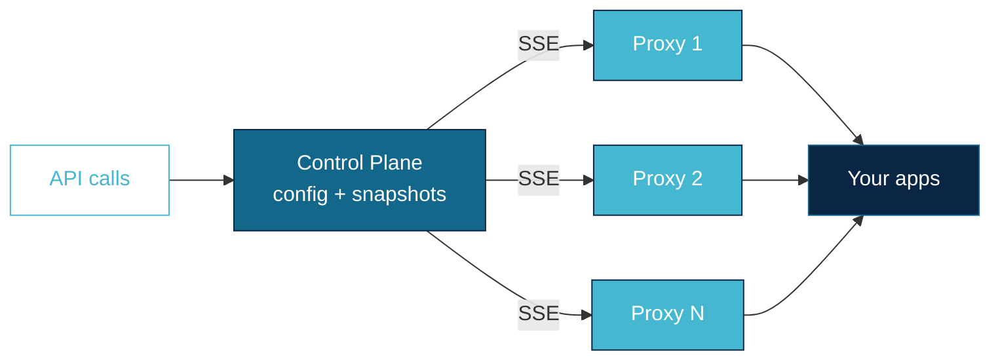

<p align="center">
  
</p>

<p align="center">
  A programmable HTTP reverse proxy. One binary, zero dependencies.<br/>
  Configure everything through a REST API. Changes apply instantly.
</p>

---

## What is Vrata?

Vrata is a reverse proxy you configure through an API instead of files. You create listeners, destinations, routes, and middlewares — Vrata applies them on the fly without restarts.

## What can you do with it?

**Route traffic** to your services using path prefixes, exact paths, regex, headers, methods, query params, hostnames, gRPC content-type, or [CEL expressions](https://github.com/google/cel-go) for complex logic.

**Split traffic** between multiple destinations with weights. Forward, redirect, or return fixed responses. Retry failed requests with backoff. Rewrite URLs. Mirror traffic for testing.

**Balance at two levels.** First, pick which destination gets the request (canary deploys, A/B testing). Then, pick which endpoint within that destination handles it (pod-level balancing). Each level has its own algorithms — from simple round robin to consistent hash to zero-disruption sticky sessions backed by Redis.

**Attach middlewares** to any route: CORS, JWT validation, external authorization, external processing, header manipulation, rate limiting, access logging. Each middleware supports CEL conditions (`skipWhen` / `onlyWhen`) so you control exactly when it runs without duplicating routes.

**Stage and publish** config changes with versioned snapshots. Nothing goes live until you activate a snapshot. Rollback is one API call.

**Discover endpoints** automatically from Kubernetes via EndpointSlice watches, or define them manually as a static list.

**Scale the control plane** to 3-5 nodes with Raft consensus for high availability.

> [!IMPORTANT]
> Every field, every parameter, every option — with JSON examples:
> **→ [docs/features.md](docs/features.md)**

## Architecture

Vrata has two components:

- **Control plane** — exposes the REST API, stores configuration, and pushes it to proxies via SSE.
- **Proxy** — stateless, connects to the control plane, receives config, routes traffic. Run 1 or 100.



You talk to the control plane. Proxies just follow.

In development, one process runs both. In production, you split them.

## Configuration

Vrata reads a YAML config file via `--config`. Every string value supports `${ENV_VAR}` substitution.

The repo includes [`config.yaml`](config.yaml) with all options commented. The two essential configs:

**Control plane** (or single-process dev):

```yaml
mode: "controlplane"
server:
  address: ":8080"
```

**Proxy** (production fleet):

```yaml
mode: "proxy"
controlPlane:
  address: "http://control-plane:8080"
  reconnectInterval: "5s"
```

Optional sections: `cluster` (Raft HA), `sessionStore` (Redis for sticky sessions), `log`. See [`config.yaml`](config.yaml) for the full reference.

## Quick start

### 1. Build and start

```bash
make build
vrata --config config.yaml --store-path /tmp/vrata.db
```

API on `:8080`. Swagger UI at [localhost:8080/api/v1/docs/](http://localhost:8080/api/v1/docs/).

### 2. Open a port

```bash
curl -X POST localhost:8080/api/v1/listeners \
  -H 'Content-Type: application/json' \
  -d '{"name": "main", "port": 3000}'
```

### 3. Create a destination

```bash
curl -X POST localhost:8080/api/v1/destinations \
  -H 'Content-Type: application/json' \
  -d '{"name": "httpbin", "host": "httpbin.org", "port": 80}'
```

### 4. Create a route

```bash
curl -X POST localhost:8080/api/v1/routes \
  -H 'Content-Type: application/json' \
  -d '{
    "name": "catch-all",
    "match": {"pathPrefix": "/"},
    "forward": {
      "destinations": [
        {"destinationId": "<dest-id>", "weight": 100}
      ]
    }
  }'
```

### 5. Go live

Config changes are staged until you activate a snapshot:

```bash
# Capture
SNAP=$(curl -s -X POST localhost:8080/api/v1/snapshots \
  -H 'Content-Type: application/json' \
  -d '{"name": "v1"}' | jq -r .id)

# Activate
curl -X POST localhost:8080/api/v1/snapshots/$SNAP/activate

# Traffic flows
curl localhost:3000/get
```

Bad deploy? Activate a previous snapshot.

## Deploy

### Single process (development)

```bash
vrata --config config.yaml --store-path /data/vrata.db
```

### Control plane + proxy fleet (production)

```bash
# Control plane
vrata --config controlplane.yaml --store-path /data/vrata.db

# Proxies (scale freely)
vrata --config proxy.yaml
```

Proxies reconnect automatically. No state — fully disposable.

### HA control plane (Raft)

Run 3-5 nodes. All accept reads; writes go through the leader.

```yaml
cluster:
  nodeId: "cp-0"
  bindAddress: ":7000"
  advertiseAddress: "${POD_IP}:7000"
  dataDir: "/data/raft"
  discovery:
    dns: "vrata-headless.vrata.svc.cluster.local"
```

### Kubernetes (Helm)

```bash
helm install vrata charts/vrata \
  --namespace vrata --create-namespace \
  -f charts/vrata/values.yaml
```

Control plane as StatefulSet, proxies as Deployment. See [`charts/vrata/values.yaml`](charts/vrata/values.yaml).

### Docker

```bash
docker run -d \
  -v ./config.yaml:/config.yaml \
  -v vrata-data:/data \
  -p 8080:8080 -p 3000:3000 \
  achetronic/vrata:latest \
  --config /config.yaml --store-path /data/vrata.db
```

## API & docs

|                       |                                                                   |
| --------------------- | ----------------------------------------------------------------- |
| **Swagger UI**        | [localhost:8080/api/v1/docs/](http://localhost:8080/api/v1/docs/) |
| **OpenAPI spec**      | `localhost:8080/api/v1/docs/doc.json`                             |
| **Feature reference** | [docs/features.md](docs/features.md)                              |
| **Config reference**  | [config.yaml](config.yaml)                                        |

## Build & test

```bash
make build            # → vrata
make test             # Unit tests
make e2e              # Proxy e2e (needs running instance)
make e2e-cluster      # Cluster e2e in kind
make docs             # Regenerate OpenAPI spec
make proto            # Regenerate protobuf code
```

## Contributing

```bash
git clone https://github.com/achetronic/vrata.git
cd vrata && make test
```

Conventions: [`.agents/CONVENTIONS.md`](.agents/CONVENTIONS.md) · Architecture: [`.agents/`](.agents/)

## License

Apache 2.0
